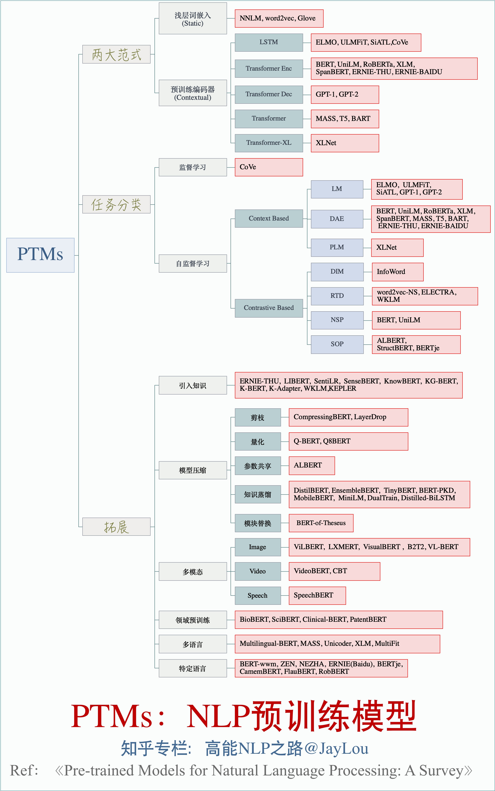

# PTMs: Pre-trained-Models in NLP
### NLP预训练模型的全面总结

## 置顶

知乎文章1:  [全面总结！PTMs：NLP预训练模型](https://zhuanlan.zhihu.com/p/115014536)  ➡️➡️ 图片下载

知乎文章2：[nlp中的预训练语言模型总结](https://zhuanlan.zhihu.com/p/76912493)

知乎文章3：[nlp中的词向量对比](https://zhuanlan.zhihu.com/p/56382372)

## 1、论文汇总：

PTMs-Papers:

1. https://github.com/thunlp/PLMpapers
2. https://github.com/tomohideshibata/BERT-related-papers
3. https://github.com/cedrickchee/awesome-bert-nlp
4. https://bertlang.unibocconi.it/
5. https://github.com/jessevig/bertviz

## 2. PTMs单模型解读

1. 自监督学习：[Self-Supervised Learning 入门介绍](https://zhuanlan.zhihu.com/p/108625273)
2. 自监督学习：[Self-supervised Learning 再次入门](https://zhuanlan.zhihu.com/p/108906502)
3. 词向量总结：[nlp中的词向量对比：word2vec/glove/fastText/elmo/GPT/bert](https://zhuanlan.zhihu.com/p/56382372)
4. 词向量总结：[从Word Embedding到Bert模型—自然语言处理中的预训练技术发展史](https://zhuanlan.zhihu.com/p/49271699)
5. BERT解读： [Bert时代的创新：Bert应用模式比较及其它](https://zhuanlan.zhihu.com/p/65470719)
6. XLNET解读：[XLNet:运行机制及和Bert的异同比较](https://zhuanlan.zhihu.com/p/70257427)
7. XLNET解读：[XLnet：比Bert更强大的预训练模型](https://zhuanlan.zhihu.com/p/71759544)
8. RoBERTa解读：[RoBERT: 没错，我就是能更强——更大数据规模和仔细调参下的最优BERT](https://zhuanlan.zhihu.com/p/75629127)
9. 预训练语言模型总结：[nlp中的预训练语言模型总结(单向模型、BERT系列模型、XLNet)](https://zhuanlan.zhihu.com/p/76912493)
10. ELECTRA解读[ELECTRA: 超越BERT, 19年最佳NLP预训练模型](https://zhuanlan.zhihu.com/p/89763176)
11. 模型压缩LayerDrop:[结构剪枝：要个4层的BERT有多难？](https://zhuanlan.zhihu.com/p/93207254)

